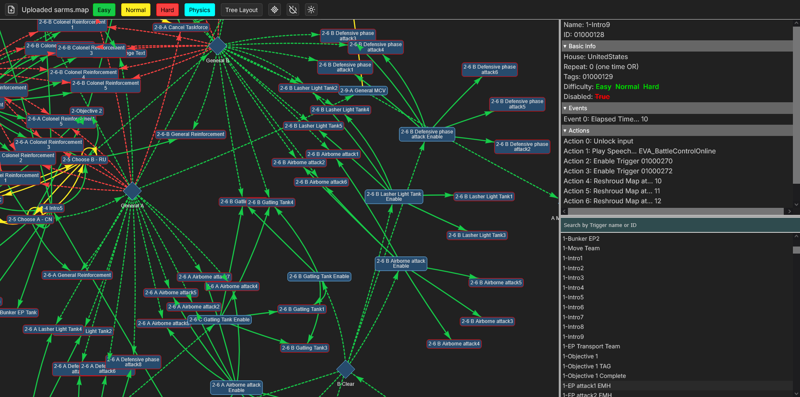

# Trigger-Analyzer

Originally created by [WhensonZWS](https://github.com/whensonZWS), the [Trigger-Analyzer](https://resarium.github.io/Trigger-Analyzer/) is a visualization tool for maps from the *Command & Conquer* series (e.g., *Tiberian Sun*, *Red Alert 2*, etc.).

It visualizes map triggers as a network graph, showing how different triggers are connected and interact with each other.

The tool is hosted on [GitHub Pages](https://resarium.github.io/Trigger-Analyzer/) and does not rely on a web server, so it can be saved and used offline.

Trigger data is defined in `fadata.ini`, which is converted to JSON format (`fadata.json`) using the `ini_parse.js` script.
The `fadata.ini` file is extracted from version 3.3.6 of the [Mental Omega](https://mentalomega.com) mod, which adds additional trigger types via [Ares 3.0](https://ares-developers.github.io/Ares-docs/index.html).

The graph is rendered using the [vis.js Network](https://visjs.github.io/vis-network/docs/network/) visualization library.
